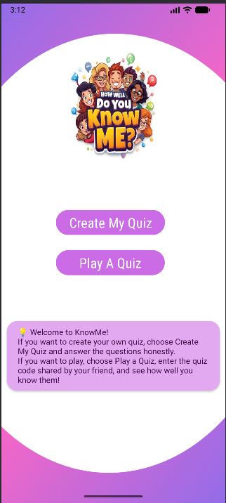
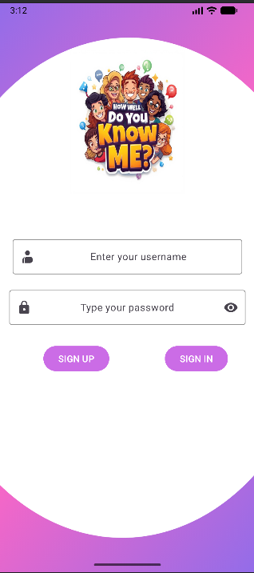
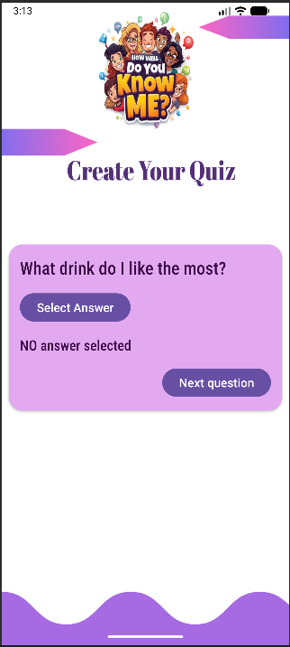
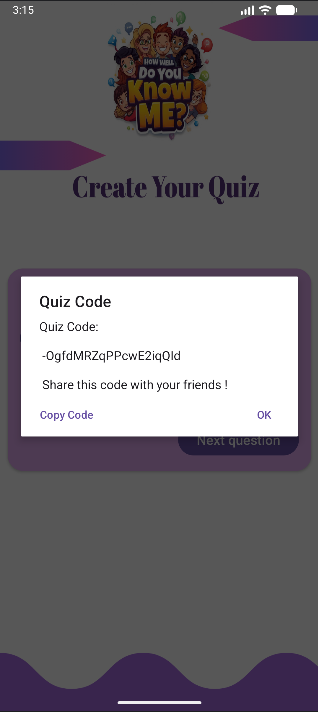
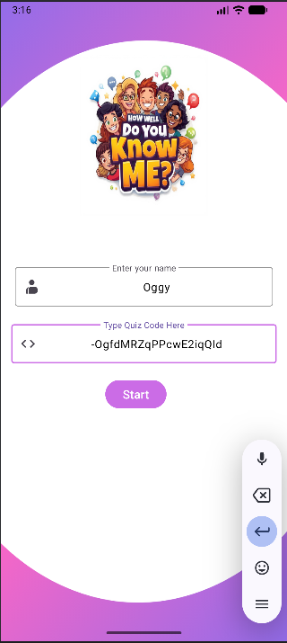
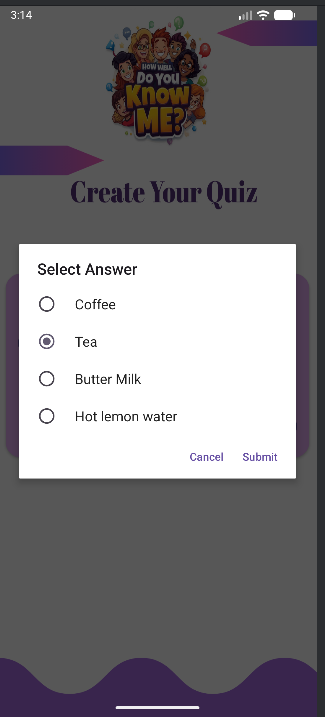
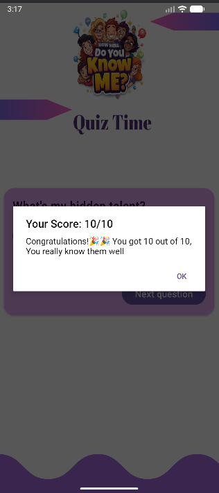
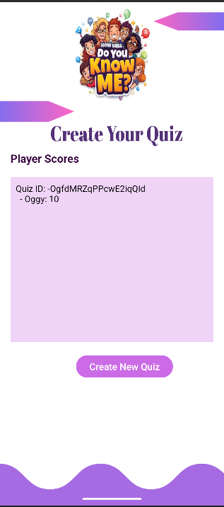

# AndroidLearnings_KnowMeQuizApp

[](https://kotlinlang.org/)
[](https://firebase.google.com/)

**KnowMeQuiz** is a fun and interactive Android application that lets you create and share quizzes to see how well your friends know you. Built with **Kotlin** and powered by **Firebase**, the app provides a smooth real-time experience for both quiz creators and players.

---

## Features
- **Dual User Roles:** Admins create quizzes, Players take them.
- **Dynamic Quiz Creation:** Admins create a 10-question quiz about themselves.
- **Unique Quiz Codes:** Each quiz is saved with a unique, shareable code.
- **Interactive Quiz Experience:** Players enter the code, answer questions, and get instant results.
- **Score Tracking:** Player names and scores are stored in Firebase.
- **Admin Score View:** Admins can view who played their quiz and how much each player scored.
- **Copy to Clipboard:** Easily copy and share the quiz code.
- **Responsive UI:** Handles questions and options of varying lengths gracefully.

---

## How It Works

### Admin Flow
1. Sign up or sign in.
2. Create a quiz by selecting correct answers for each question.
3. Quiz is saved to Firebase and a unique quiz code is generated.
4. Share the quiz code with friends.
5. View player scores in real time as friends complete the quiz.

### Player Flow
1. Enter name and quiz code.
2. Play the quiz fetched from Firebase.
3. View final score with a fun, personalized message.
4. Player score is saved under the quiz for admin viewing.

---

## Technologies Used
- **Kotlin**
- **Firebase Realtime Database**
- **Android SDK**
- **Material Design & View Binding**

---

## Future Enhancements
- Show **admin’s correct answers** after the quiz.
- Highlight **which questions the player got wrong**.
- Detailed result breakdown per question.
- Leaderboard with rankings.
- QR code-based quiz sharing.
- Firebase Authentication for enhanced security.

---
## 📸 Screenshots

|Start Screen |Admin UI|Quiz section |Share Quiz Code |Player UI |Answer Quiz|Score| Show Score|
| :---:| :---: | :---: | :---: | :---: |   :---: |   :---: | :---: |  
| | | |  |  ||| |


## Installation
1. Clone the repository:
```bash
git clone https://github.com/Swarnima-Khadka1/AndroidLearnings_KnowMeQuizApp.git
```
## Download APK
Download from the Releases section:
```bash
https://github.com/Swarnima-Khadka1/AndroidLearnings_KnowMeQuizApp/releases
```
